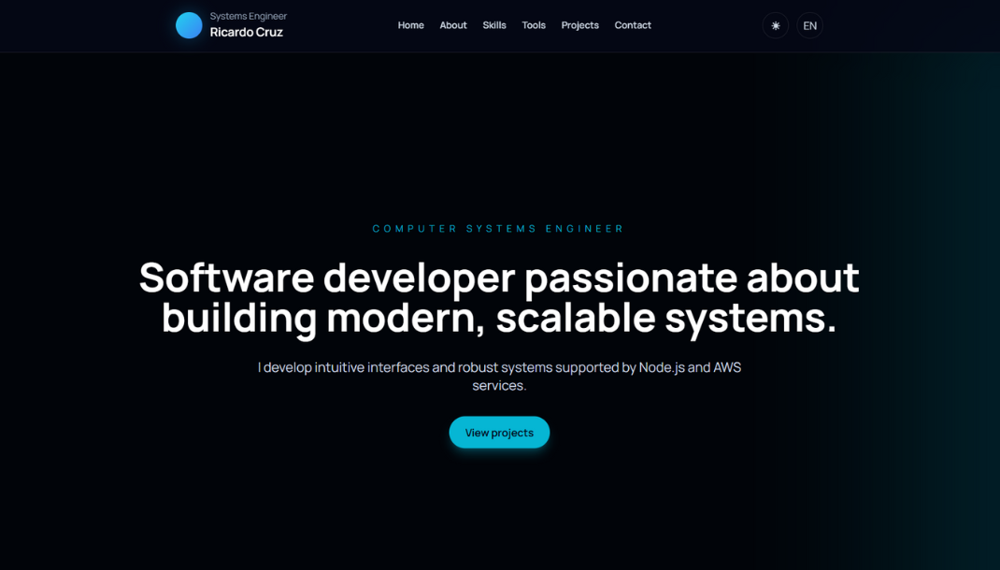

# Portafolio Web

Sitio web de portafolio desarrollado como una aplicación frontend moderna, con diseño minimalista, enfoque tecnológico.

   

---

## Demo

[Portafolio](https://richardrc1994.github.io/portafolio/)

---

## Descripción del proyecto

Este proyecto es un sitio web de portafolio que presenta secciones informativas, habilidades técnicas y elementos visuales interactivos.  
Está diseñado para ser ligero, rápido y compatible tanto con ejecución local como con despliegue en producción mediante GitHub Pages.

---

## Tecnologías utilizadas

### Frontend
- HTML
- CSS / Tailwind CSS
- JavaScript

### Funcionalidades
- Modo claro / oscuro
- Soporte multilenguaje (ES / EN)
- Animaciones al hacer scroll
- Diseño responsivo
- Estilos minimalistas con estética tecnológica

